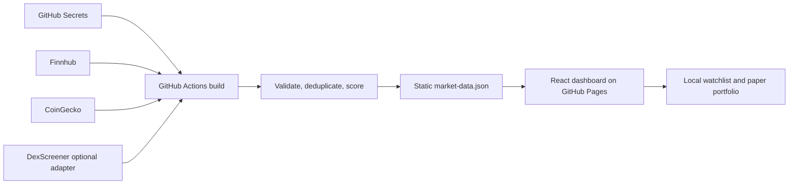

[Breakout-Radar-README.md](https://github.com/user-attachments/files/31162390/Breakout-Radar-README.md)
# Breakout Radar

Breakout Radar is a dark, mobile-first investment-research dashboard for speculative stocks, established cryptocurrencies, and meme coins. It emphasizes transparent calculations, skeptical thesis framing, data provenance, and risk controls. It does **not** place trades, connect to a brokerage, predict guaranteed gains, or encourage coordinated buying.

> Speculative Investment Research — Not Financial Advice

## What the first working version includes

- Ranked top-five dashboard for stocks, established crypto, and meme coins
- Independent opportunity score (0–100) and risk score/grade (A–F)
- Stock screener with price, capitalization, dollar-volume, short-interest, momentum, exchange, horizon, risk, and data-quality filters
- Retail-driven (“Dumb Money-style”) setup detector using careful language such as “potential squeeze conditions”
- Established crypto research centered on usage, liquidity, tokenomics, development, and security
- Meme scanner with severe-warning and disqualification rules that never labels a token safe
- Detail pages with charts, raw metrics, weighted sub-scores, penalties, bull/bear cases, catalysts, risks, invalidation points, and assumption-based scenarios
- Browser-local watchlist and paper portfolio; no brokerage integration
- Position-size, maximum-loss, expected-value, risk/reward, diversification, volatility, and concentration tools
- Build-time API retrieval with retries, validation, stale flags, deduplication, and demo fallback
- Automated tests and GitHub Pages deployment

## Architecture in plain language

GitHub Pages can only serve files; it cannot safely hold or run secret API keys. Breakout Radar therefore uses a two-part design:

1. **Private build step:** GitHub Actions reads API keys from GitHub Secrets. The scripts in `scripts/` call market-data providers, validate responses, calculate normalized scores, and write `public/data/market-data.json`. The workflow uses the checked-in pnpm lockfile for repeatable installs; beginners may still use the familiar `npm` commands below locally.
2. **Public website:** Vite builds the React app into ordinary HTML, CSS, JavaScript, and JSON files. The browser reads only the generated JSON. It never receives an API key.

If an API key is absent or a provider fails, that asset group uses a clearly marked demo dataset. A mixed build can contain live crypto and demo stocks, for example; each asset carries its own source, timestamp, quality, stale, and demo labels.



## Complete folder structure

```text
breakout-radar/
├── .github/
│   └── workflows/
│       └── deploy.yml
├── public/
│   └── data/
│       └── market-data.json       # generated; demo or live/mixed
├── scripts/
│   ├── adapters/
│   │   ├── coingecko.ts
│   │   ├── dexscreener.ts
│   │   └── finnhub.ts
│   ├── lib/
│   │   └── http.ts
│   ├── generate-market-data.ts
│   └── validate.ts
├── src/
│   ├── components/
│   │   ├── AssetCard.tsx
│   │   ├── DataBadge.tsx
│   │   ├── DisclaimerBanner.tsx
│   │   ├── FilterBar.tsx
│   │   ├── Layout.tsx
│   │   ├── Metric.tsx
│   │   ├── PriceChart.tsx
│   │   ├── ScoreGauge.tsx
│   │   └── States.tsx
│   ├── context/
│   │   └── RadarContext.tsx
│   ├── data/
│   │   ├── demoAssets.ts
│   │   └── loadMarketData.ts
│   ├── hooks/
│   │   └── useLocalStorage.ts
│   ├── pages/
│   │   ├── AssetDetailPage.tsx
│   │   ├── DashboardPage.tsx
│   │   ├── DumbMoneyPage.tsx
│   │   ├── ScreenerPage.tsx
│   │   ├── ToolsPage.tsx
│   │   └── WatchlistPage.tsx
│   ├── types/
│   │   └── market.ts
│   ├── utils/
│   │   ├── format.ts
│   │   ├── risk.ts
│   │   └── scoring.ts
│   ├── App.tsx
│   ├── index.css
│   ├── main.tsx
│   └── vite-env.d.ts
├── tests/
│   ├── risk.test.ts
│   ├── scoring.test.ts
│   └── setup.ts
├── .env.example
├── .gitignore
├── index.html
├── package.json
├── pnpm-lock.yaml
├── pnpm-workspace.yaml
├── postcss.config.js
├── tailwind.config.js
├── tsconfig.app.json
├── tsconfig.json
├── tsconfig.node.json
└── vite.config.ts
```

## Data providers and honest coverage

| Provider | Used for | Key required? | Important limitation |
|---|---|---:|---|
| [Finnhub](https://finnhub.io/) | Stock quotes, profiles, basic metrics | Yes | Free coverage does not provide every requested short, borrow, dilution, filing, or options field. Missing values show “Data unavailable.” |
| [CoinGecko](https://www.coingecko.com/en/api) | Established crypto and meme-coin market data | Optional demo key | Market data does not prove contract safety, holder distribution, locked liquidity, developer activity, or protocol economics. |
| [DexScreener](https://docs.dexscreener.com/api/reference) | Optional, exact-name/symbol DEX liquidity adapter | No | Tickers can be copied. The adapter refuses non-exact names, and is not treated as a security audit. |

The current generator conservatively leaves unsupported fields blank. It does not fill them with estimates. For institutional-quality short interest, borrow fees, analyst revisions, insider transactions, SEC-form parsing, active addresses, protocol revenue, token unlocks, holder concentration, and contract security, add licensed/specialist providers in new adapter files and cite each raw response.

## Scoring and risk

Published weights live in [`src/utils/scoring.ts`](src/utils/scoring.ts). Tests verify that every group sums to 100%.

- Stocks: financial quality 20%, valuation 15%, growth 15%, catalysts 15%, momentum 10%, potential squeeze conditions 10%, liquidity 10%, data quality 5%. Dilution, debt, poor liquidity, accounting, missing data, reverse splits, insider selling, and volatility are separate penalties.
- Established crypto: adoption 20%, liquidity 15%, tokenomics 15%, developer activity 15%, security 15%, catalysts 10%, momentum 5%, data quality 5%.
- Meme coins: liquidity 20%, contract safety 20%, holder distribution 15%, volume quality 10%, tokenomics 10%, momentum 10%, community 5%, exchange access 5%, data quality 5%.

Opportunity and risk remain independent. A high opportunity result never erases a severe warning or disqualification. Normalized sub-scores are calculated research indicators, not raw provider metrics or forecasts.

## Step 1: Create a GitHub account

1. Open [github.com](https://github.com/).
2. Click **Sign up**.
3. Enter your email address, create a password and username, then complete GitHub’s verification.
4. Verify the email message GitHub sends you.

GitHub is the service that stores the project and publishes the site. A “repository” (often shortened to “repo”) is simply the project’s folder on GitHub.

## Step 2: Create the repository

1. Sign in to GitHub.
2. Click the **+** at the upper-right, then **New repository**.
3. Name it `breakout-radar`.
4. Choose **Public**. GitHub Pages availability for private repositories depends on your plan.
5. Leave **Add a README**, `.gitignore`, and license unchecked because those files already exist here.
6. Click **Create repository**.
7. Keep the resulting page open; it contains upload instructions and your repository address.

## Step 3: Upload the files without using a terminal

1. On the empty repository page, click **uploading an existing file**.
2. Open this project folder on your computer.
3. Drag the source files and folders shown in the structure above into GitHub’s upload area. **Do not upload `node_modules/` or `dist/`**; they are generated locally and can contain thousands of files. Hidden source folders beginning with a dot, especially `.github`, may not appear in Finder by default. On macOS, press **Command + Shift + .** to show them. On Windows Explorer, enable **View → Show → Hidden items**.
4. At the bottom, type `Initial Breakout Radar website` in the commit-message box.
5. Click **Commit changes**.

If GitHub’s web uploader rejects the number or size of files, install [GitHub Desktop](https://desktop.github.com/), choose **Add an Existing Repository from your Hard Drive**, select this project folder, then click **Publish repository**. GitHub Desktop is the easiest no-terminal alternative for future updates.

## Step 4: Get and add API keys

The site works without keys in demo mode. Add keys when you want build-time provider data.

### Finnhub key for stocks

1. Create a free account at [Finnhub](https://finnhub.io/register).
2. Copy the API key from its dashboard.
3. In your GitHub repository, open **Settings → Secrets and variables → Actions**.
4. Click **New repository secret**.
5. Name it exactly `FINNHUB_API_KEY`.
6. Paste the key into **Secret**, then click **Add secret**.

### Optional CoinGecko demo key

1. Open the [CoinGecko API page](https://www.coingecko.com/en/api) and create a Demo API account/key.
2. Return to **Settings → Secrets and variables → Actions** in GitHub.
3. Add a secret named exactly `COINGECKO_API_KEY`.
4. Paste the key and save it.

Do not put real keys in `.env.example`, source files, browser code, or a GitHub issue. The `.env` filename is ignored by Git. Never rename these variables to start with `VITE_`; Vite exposes `VITE_` variables to browsers.

## Step 5: Enable GitHub Pages

1. In the repository, open **Settings → Pages**.
2. Under **Build and deployment**, choose **GitHub Actions** as the source.
3. Open the repository’s **Actions** tab.
4. Click the workflow named **Build market data and deploy Breakout Radar**.
5. Click **Run workflow → Run workflow** if it has not run automatically.
6. Wait for the build and deploy jobs to show green check marks.
7. Return to **Settings → Pages**. GitHub displays the public address, usually `https://YOUR-USERNAME.github.io/breakout-radar/`.

The workflow also refreshes the site on weekdays. Provider rate limits or missing keys trigger labeled fallback data instead of a broken build.

## Run locally (on your own computer)

“Locally” means the site runs only on your computer for testing.

1. Install the current **LTS** version of [Node.js](https://nodejs.org/). Node includes `npm`, the package installer used by this project.
2. Download the repository: on GitHub click **Code → Download ZIP**, unzip it, and open the resulting folder.
3. Open a terminal in that folder:
   - macOS: right-click the folder in Finder and choose **New Terminal at Folder** (enable this in System Settings → Keyboard → Keyboard Shortcuts → Services if missing).
   - Windows: right-click inside the folder and choose **Open in Terminal**.
4. Install the project packages:

   ```bash
   npm install
   ```

5. Start the site in demo mode:

   ```bash
   npm run dev
   ```

6. The terminal prints an address such as `http://localhost:5173`. Open it in a browser. Keep the terminal open while using the site. Press **Control + C** in the terminal to stop it.

### Optional local API data

1. Duplicate `.env.example` and rename the copy `.env`.
2. Paste keys after the equals signs, with no quotes:

   ```dotenv
   FINNHUB_API_KEY=your_finnhub_key
   COINGECKO_API_KEY=your_optional_coingecko_key
   FORCE_DEMO_DATA=false
   ```

3. Generate the JSON, then run the site:

   ```bash
   npm run generate-data
   npm run dev
   ```

## Check the project before publishing

Run all three commands:

```bash
npm test
npm run typecheck
FORCE_DEMO_DATA=true npm run build
```

The final command creates `dist/`, the same public website GitHub Pages receives. `FORCE_DEMO_DATA=true` makes the check independent of provider access.

## Deploy updates

With GitHub’s website:

1. Open the file you want to change in the repository.
2. Click the pencil icon, edit, then click **Commit changes**.
3. Every commit to the `main` branch automatically runs tests, refreshes data, builds, and deploys the site.

With GitHub Desktop:

1. Edit the local files in a text editor such as [Visual Studio Code](https://code.visualstudio.com/).
2. Open GitHub Desktop and review the changed files.
3. Enter a short summary, click **Commit to main**, then **Push origin**.
4. Watch the GitHub **Actions** tab until the workflow is green.

## Common problems

### The page is blank or shows 404

- Confirm **Settings → Pages → Source** says **GitHub Actions**.
- Confirm the Actions build and deploy jobs are green.
- Do not open `index.html` directly from Finder; use `npm run dev` or the GitHub Pages URL.
- This app uses hash-based routes (`/#/stocks`) so detail pages work on static GitHub Pages.

### The site says DEMO or MIXED DATA

- Demo mode is intentional when a key is missing or a provider fails.
- Check that secret names exactly match `FINNHUB_API_KEY` and `COINGECKO_API_KEY`.
- GitHub Secrets cannot be read by code from untrusted pull requests; deploy from `main`.
- Review the generated site’s data-mode message and the workflow logs for the provider error.

### `npm` is “not recognized” or “command not found”

Install the LTS version of Node.js, close the terminal, open a new terminal, and run `node --version`. A version number confirms installation.

### `npm install` fails

- Confirm you are inside the project folder containing `package.json`.
- Confirm your internet connection.
- Delete only the `node_modules` folder and run `npm install` again. Do not delete source folders.

### API rate-limit errors (HTTP 429)

The fetch utility automatically retries with increasing delays. Free providers still impose limits. Reduce the comma-separated `STOCK_SYMBOLS` list, wait for the limit to reset, or use demo mode. The weekday workflow uses a deliberately irregular minute to reduce peak-time congestion.

### Some fields say “Data unavailable”

That is expected when the cited provider does not supply a field. Breakout Radar does not guess. Add a reputable adapter that returns the field, validate it, cite it, and keep raw fields separate from calculated sub-scores.

### The watchlist or paper portfolio disappeared

Both are stored in browser local storage. Clearing site data, switching browsers, using private mode, or changing devices removes that local information. No account or cloud synchronization is included.

## Safety and data-integrity principles

- No guarantee, coordinated-buying language, trade execution, or fake analyst recommendation
- Nominal share price never treated as proof of undervaluation
- Every number comes from a cited provider or a conspicuously labeled demo record
- Missing fields remain missing; malformed data is rejected or changed to null
- Raw values, normalized score components, and scenarios are separately labeled
- Stale timestamps and low/insufficient quality are visible
- Severe token-security evidence is not overridden by momentum
- Scenarios state assumptions and do not invent price targets

## Extending providers

Add a file under `scripts/adapters/`, return the typed fields from `src/types/market.ts`, validate the response, add a source link and retrieval time, and call it from `scripts/generate-market-data.ts`. Never import a server key into `src/`; everything under `src/` ships to browsers.

When adding a metric, add formula/risk tests under `tests/`, run the checks above, and document the provider limitation here.
